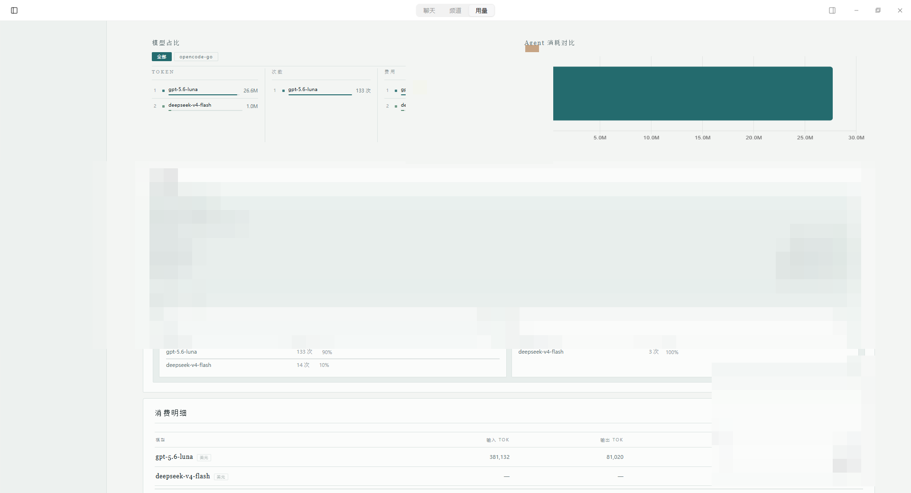
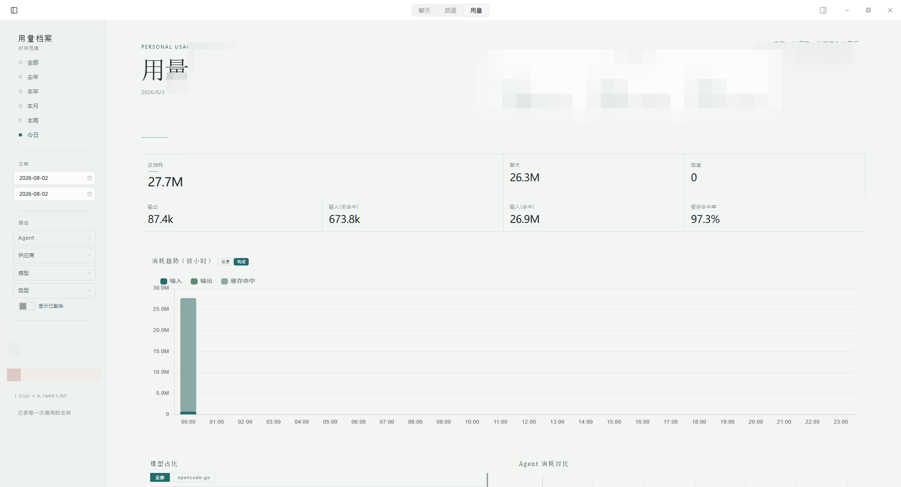

<div align="center">

# 📊 HanaAgent Token Tracker

<p align="center">
  <b>HanaAgent / OpenHanako 官方口径 Token 用量统计、多模型消耗占比与余额查询仪表盘插件</b>
</p>

[](https://github.com/liliMozi/openhanako)
[](https://developer.mozilla.org/en-US/docs/Web/JavaScript)
[](LICENSE)
[]()

</div>

---

## 📖 简介

HanaAgent 的 Token 消耗统计、余额查询、媒体生成统计仪表盘插件。支持按日/周/月/年时间筛选，多模型与多 Agent 维度对比，以及对齐官方账单口径的精准计费分析。

## 📸 界面预览

> 截图已对账户金额、余额、订阅额度、时间戳等敏感信息做打码处理。

仪表盘总览（模型占比、Agent 消耗对比、消费明细）：



用量档案（时间筛选、消耗趋势、指标卡）：



## 变更日志(v0.3.8)

基于原版 v0.3.7(CACHE_VERSION=12),由 Brunhild 进行以下定制改动:

### 第一批:Bug 修复

1. **日历下拉星期六列溢出** - `.cal-grid div` 移除固定 `width:32px;height:32px`,改用 `aspect-ratio:1` 自适应
2. **图表自动缩放失真** - canvas 外包 `.chart-box` flex 容器,移除 CSS `!important` 锁定,Chart.js v4 响应式正常工作
3. **来源分布条单来源被隐藏** - 隐藏条件 `length<=1` 改为 `===0`

### 第二批:功能补全

4. **消耗来源七分类** - 新增 Bridge/任务/子代理/系统四类,scanLedger 扫描 usage-ledger.json
5. **缓存命中率分析** - 按 Agent 和模型两维度,环形+对比条+下钻表
6. **月度消耗预测** - 初始指数平滑,后替换为历史小时分布累计百分比法
7. **趋势图缓存命中率折线** - 无消耗时点填 null + spanGaps,纯系统时点排除
8. **分类重命名** - 后台→任务,账本→系统
9. **趋势图图例顺序** - 聊天→子代理→Bridge→频道→任务→系统→缓存命中率
10. **Tooltip 双模式切换** - Mode A 仅当前项 / Mode B 全部来源,存 localStorage

### 第三批:数据修复

11. **scanLedger 补 provider** - CACHE_VERSION 14→15,修复模型占比饼图"未归属"缺口
12. **scanLedger 补 hourlyBreakdown** - CACHE_VERSION 15→16,修复"系统"柱状图小时模式不显示

### 第四批:供应商接入

13. **火山方舟 Coding Plan** - V4 签名 + GetCodingPlanUsage API,三窗口配额展示 + 重置倒计时
14. **设置面板折叠** - 订阅余量和模型定价区域可折叠,收起时显示配置状态

### 第五批:交互优化

15. **下拉选项累积逻辑** - Agent/模型下拉累积所有历史,供应商下拉跟随日期范围
16. **手动刷新改增量** - 默认增量扫描,Shift+点击全量重建
17. **启动扫描非阻塞** - onload 不再 await 扫描,主界面秒出,后台扫描完成后自动加载数据
18. **消耗预测重写** - 删除指数平滑,改为 cumulativePct + P_now 实时计算,请求时算 predictedToday 和 trend
19. **方舟卡片 UI** - 删除状态行,重置行改为左侧日期 + 右侧倒计时(月窗口显示 Xd Xh Xm)

### 第六批:Bug 修复

20. **模型占比图例溢出不可滚动** - 禁用 Chart.js 内置 canvas 图例,改用外置 HTML 图例容器(max-height 110px + overflow-y auto),滚动条样式复用 theme.css 现有规范(5px 宽,text-tertiary 色),模型过多时可滚动查看,饼图不再被挤压
21. **usage 对象格式数据污染** - 新增 `tokVal()` 适配 input/output 为对象结构({totalTokens:xxx})的 usage 格式,`||` 改 `??` 修复 totalTokens 为 0 时错误 fallback 到对象导致 [object Object] 字符串污染的问题

---

## 目录结构

```
token-tracker/
├── index.js              # 后端数据采集:JSONL 扫描 + 缓存 + 实时监控
├── manifest.json         # 插件元数据(page 注册,无 widget)
├── routes/
│   └── dashboard.js      # API 路由 + 数据构建 + 余额查询 + 价格计算
└── app/
    ├── dashboard-app.js  # 前端 SPA(卡片、图表、悬浮卡片、设置面板)
    ├── base.css          # 布局骨架 + 组件样式
    └── theme.css         # 暖纸/青夜主题色板
```

数据目录(`~/.hanako/plugin-data/token-tracker/`):
```
├── price-table.json      # 模型定价配置(支持 token/per_call/per_char 三种计费)
├── balance-apis.json     # 余额查询 API 配置
└── token-cache.json      # 扫描缓存(CACHE_VERSION=16)
```

---

## 主要功能点

### 1. Token 用量统计
- 按日/周/月/年/自定义日期范围筛选
- 按 Agent、供应商、模型、会话类型筛选
- 展示:总消耗、聊天/频道、输入/输出/缓存命中、请求次数
- 趋势图(日/小时)、模型占比饼图、Agent 对比柱图

### 2. 图片/视频生成统计
- 从会话 JSONL 中解析 `image-gen_generate-image` / `image-gen_generate-video` toolCall
- 统计每个供应商/模型的调用次数和成功次数
- 按 Token 用量 / 图片生成 / 视频生成 三个分区展示
- 每个模型显示:调用次数、成功次数、费用

### 3. 余额查询
- 从 `balance-apis.json` 读取 API URL
- API key 从 `added-models.yaml` 读取(优先),`provider-catalog.json` 兜底
- 自动判断返回类型:配额制(进度条)或货币制(¥金额)
- DeepSeek 多条余额明细展示
- MiniMax token-plan 订阅余量(5小时窗口 + 周窗口)
- 火山方舟 Coding Plan 三窗口配额(5小时/周/月,含重置倒计时)

### 4. 费用估算
- 价格表外部化到 `price-table.json`,设置面板可编辑
- 三种计费方式:
  - `token`:按 input/output/cacheRead token 数 × 每百万 token 价格
  - `per_call`:按调用次数 × 每次价格(图片/视频生成模型)
  - `per_char`:按字符数 × 每万字符价格(TTS 模型)
- per_call 模型使用 mediaGen 的 callCount 而非 assistantCount

### 5. 悬浮卡片
- 固定在页面右侧,按供应商分组
- 显示余额(配额制/货币制区分)+ 各模型消耗
- per_call 模型显示调用次数+成功数+费用
- 未在 providerConfig 中的媒体供应商也会显示
- 方舟 Coding Plan:三窗口余量进度条 + 重置倒计时

### 6. 设置面板
- 右侧滑出,宽度 620px
- 保存按钮在右上角
- 订阅余量配置(可折叠):Sensenova + 火山方舟 Coding Plan
- 模型定价(可折叠):每个模型行带配置状态标签
- 显示偏好:趋势图 tooltip 显示模式切换(仅当前项 / 全部来源)
- 供应商和模型列表从 HanaAgent 配置动态获取

### 7. 消耗来源分类
- 七类来源:聊天/频道/Bridge/任务/子代理/系统
- 来源分布条展示各来源占比
- 趋势图柱状图按来源分类堆叠

### 8. 缓存命中率分析
- 按 Agent 和模型两个维度计算缓存命中率
- 环形展示 + 对比条 + 下钻表
- 趋势图叠加缓存命中率折线(无消耗时点填 null + spanGaps)

### 9. 消耗预测
- 基于历史小时分布的累计百分比法
- 历史天数 ≥ 3 时启用小时分布预测,不足时回退日均
- 实时计算当前时刻占比 P_now(Asia/Shanghai 时区,线性插值)
- 今日预估:todayTokens / P_now,封顶 todayTokens + dailyAvg × (1-P_now) × 1.5
- 趋势:今日实际 vs 历史同时段预期(±5% 容差)
- 月底预估:monthToDate + dailyAvg × daysLeftInMonth

---

## 数据来源与获取方式

### 会话数据(JSONL)

**文件位置**:
- 桌面端:`~/.hanako/agents/<agentId>/sessions/<timestamp>_<uuid>.jsonl`
- 归档:`~/.hanako/agents/<agentId>/sessions/archived/<timestamp>_<uuid>.jsonl`
- 频道端:`~/.hanako/agents/<agentId>/phone/sessions/<subDir>/<timestamp>_<uuid>.jsonl`
- Bridge:`~/.hanako/agents/<agentId>/sessions/bridge/<owner|guests>/<timestamp>_<uuid>.jsonl`
- 后台活动:`~/.hanako/agents/<agentId>/activity/<timestamp>_<uuid>.jsonl`
- 子代理:`~/.hanako/agents/<agentId>/subagent-sessions/<subDir>/<timestamp>_<uuid>.jsonl`
- 系统账本:`~/.hanako/usage-ledger.json`(attribution.kind 为 memory/utility 的条目)

**文件格式**:JSONL,每行一个 JSON 对象。

**扫描逻辑**(`index.js` → `scanDir`):
- 增量扫描:通过文件 mtime 判断是否变化,未变化则跳过
- CACHE_VERSION 变更时触发全量重扫
- 启动时后台执行,不阻塞插件加载(`shared.scanning` 互斥锁防并发)
- 手动刷新默认增量,Shift+点击全量重建
- 只处理 `type === "message"` 的行(媒体生成额外处理 `type === "custom"`)

**Token 用量数据提取**:
```
JSONL 行 (type="message", role="assistant")
  └─ message.usage: { input, output, cacheRead, totalTokens, cost }
  └─ message.model: 模型名
  └─ message.provider: 供应商(可能为空,需靠 model_change 事件追踪)
```

**媒体生成数据提取**(三步关联):

1. **toolCall**(assistant 消息中):
```
message.content[type="toolCall"]
  └─ name: "image-gen_generate-image" | "image-gen_generate-video"
  └─ arguments.model: 媒体模型名(可能为空 → 标记为 "default-image"/"default-video")
  └─ arguments.provider: 媒体供应商(可能为空 → 标记为 "default")
  └─ id: toolCallId(用于关联 toolResult)
```

2. **toolResult**(关联 taskId):
```
message (role="toolResult", toolName starts with "image-gen_")
  └─ toolCallId: 关联到 toolCall
  └─ details.mediaGeneration.tasks[].taskId: 异步任务 ID
```

3. **hana-deferred-result**(custom 事件,统计成功):
```
type="custom", customType="hana-deferred-result"
  └─ data.taskId: 匹配 toolResult 中的 taskId
  └─ data.status: "success" | "failed"
  └─ data.type: "image-generation" | "video-generation"
```

**关联机制**:toolCall.id → toolResult.toolCallId → taskId → hana-deferred-result.taskId

### 供应商配置

**文本模型供应商**:`~/.hanako/provider-catalog.json`
```json
{
  "providers": {
    "deepseek": { "api_key": "sk-xxx", "models": ["deepseek-v4-flash", ...] },
    "agnes": { "api_key": "sk-xxx", "models": ["agnes-2.0-flash", ...] }
  }
}
```

**多媒体供应商**:`~/.hanako/user/preferences.json`
```json
{
  "imageGeneration": { "providerDefaults": { "agnes": { "models": { "agnes-image-2.1-flash": {} } } } },
  "videoGeneration": { "providerDefaults": { "agnes": { "models": { "agnes-video-v2.0": {} } } } }
}
```

**API Key 读取优先级**:`added-models.yaml` > `provider-catalog.json`

### 价格表(price-table.json)

```json
{
  "deepseek/deepseek-v4-flash": { "unit": "token", "inputPerM": 1, "inputCachePerM": 0.02, "outputPerM": 2 },
  "glm/GLM-Image": { "unit": "per_call", "pricePerCall": 0.1 },
  "minimax/speech-01": { "unit": "per_char", "pricePer10K": 2 }
}
```

### 余额查询(balance-apis.json)

```json
{
  "deepseek": { "url": "https://api.deepseek.com/user/balance" },
  "glm": { "url": "https://open.bigmodel.cn/api/paas/v4/users/me/balance" },
  "sensenova": { "responseType": "per-model-quota", "url": "...", "token": "...", "modelIds": [...] },
  "volcengine-coding": { "responseType": "volcengine-coding-plan", "ak": "...", "sk": "...", "region": "cn-beijing" }
}
```

类型自动判断逻辑(`dashboard.js` → `fetchBalance`):
1. `balance_infos` 数组 → DeepSeek 格式(货币制,多条明细)
2. `data.limits` + `TOKENS_LIMIT` → GLM 格式(配额制,百分比)
3. `responseType: "per-model-quota"` → Sensenova 格式(按模型展示余量)
4. `responseType: "volcengine-coding-plan"` → 火山方舟 V4 签名 + GetCodingPlanUsage API
5. 其他 → 通用货币格式(尝试 `available_balance`/`balance`/`total_balance` 等字段)

---

## 踩坑点

### 1. SSE 实现方式
Hana 的路由框架不支持 `c.res.writeHead()`,必须用 `ReadableStream` + `c.body()` 实现 SSE:
```js
const stream = new ReadableStream({
  start(controller) { /* enqueue data */ },
  cancel() { /* cleanup */ }
});
c.header("Content-Type", "text/event-stream");
return c.body(stream);
```

### 2. bus.subscribe 过滤器
`bus.subscribe` 的 `{ types: [...] }` 过滤器可能不工作,改为在回调内手动过滤:
```js
const unsub = bus.subscribe((ev) => {
  if (ev?.type !== "token_usage") return;
  // 处理逻辑
});
```

### 3. token_usage 事件接收
`token_usage` 事件通过 `bus.subscribe` 接收不稳定,widget 的 SSE 实时推送功能可能未生效。当前主要依赖定时扫描(`scanAll`)更新数据。

### 4. Token 统计字段
`input` 字段**不包含** `cacheRead`,它们是分开统计的:`input + output + cacheRead = totalTokens`。费用计算时 cacheRead 使用更低的 `inputCachePerM` 价格。

### 5. 媒体生成 toolCall 无 model/provider
当用户使用默认模型时,toolCall 的 `arguments` 中**不包含** `model` 和 `provider` 字段。处理方式:
- model 为空 → 根据工具名标记为 `default-image` 或 `default-video`
- provider 为空 → 标记为 `default`

### 6. 媒体生成成功次数统计
`successCount` 需要三步关联(toolCall → toolResult → hana-deferred-result),任一环节缺失都会导致 successCount 为 0。常见原因:
- toolResult 中没有 `details.mediaGeneration`
- hana-deferred-result 中的 taskId 与 toolResult 中的不匹配
- 异步结果尚未返回时扫描已完成

### 7. 供应商配置来源迁移
`added-models.yaml` 已过时但仍在使用(API key 读取)。供应商模型列表现在从两个位置读取:
- `provider-catalog.json`:文本模型
- `preferences.json`:多媒体模型

### 8. 余额查询 API 类型自动判断
不让用户手动选择类型,而是根据返回 JSON 结构自动判断。新增供应商余额 API 时无需指定类型字段。

### 9. per_call 模型费用计算
per_call 模型的费用必须使用 `mediaGen.callCount`(实际生成次数),而非 `assistantCount`(LLM 请求次数)。因为一次 LLM 请求可能触发多个媒体生成,而媒体生成本身不产生 token 用量。

### 10. 缓存版本与全量重扫
修改 `index.js` 中的数据结构后,必须递增 `CACHE_VERSION`,否则旧缓存结构不兼容会导致数据异常。递增后会自动触发全量重扫。

### 11. 多媒体模型计费分类
- **按 token**:视觉理解模型(如 kimi-k2.6、GLM-4V)
- **按次/按张**:图像生成(GLM-Image 0.1元/次、CogView-4 0.06元/次、MiniMax image-01 0.025元/张)
- **按次(分档)**:视频生成(CogVideoX-3 1元/次、MiniMax Hailuo 按分辨率/时长 1.35~4元/次)
- **按字符**:TTS(MiniMax speech 2~3.5元/万字符)
- **按时长**:语音识别(按分钟)

### 12. 智谱/即梦定价获取
- 智谱定价页面是 SPA,无法直接抓取具体价格数字
- 即梦(Jimeng)是消费级产品,没有公开 API 定价页面
- Google Gemini 定价页面可能超时

### 13. 插件页面必须发送 ready 消息
Hana 前端加载插件 iframe 时,会监听 `postMessage` 的 `ready` 消息,收到后才将 iframe 设为可见。如果不发送这个消息,Hana 会等到超时(约 7 秒)才显示,导致用户感觉页面打开很慢。必须在页面加载后立即发送:
```html
<script>
window.parent.postMessage({source:"hana-plugin",type:"ready"},"*");
</script>
```
注意:这段脚本必须放在独立的 `<script>` 标签中,不能与主逻辑的 `<script>` 标签混用,否则 `</script>` 会提前关闭标签导致页面崩溃。

### 14. 路由路径不要用连字符
Hono 路由路径中的连字符 `-` 会导致 404。例如 `/gallery/save-to-dir` 无法注册,改为 `/gallery/save` 即可。

### 15. `catch(){}` 语法不兼容
Node.js 不支持省略 catch 参数的 `catch(){}` 或 `catch{}` 写法,必须写成 `catch(e){}`。浏览器中部分版本也不支持。

### 16. 前端 API 请求必须带 token
插件页面在 iframe 中加载时,URL 自带 `?token=xxx` 参数。前端所有 fetch 请求都必须附加这个 token,否则返回 403。推荐方式:
```js
var _qs = window.location.search || '';
function apiUrl(path, suffix) { return API_BASE + path + _qs + (suffix || ''); }
```
注意 `_qs`(token 部分)必须放在额外参数**之前**,确保 URL 格式为 `?token=xxx&type=images` 而非 `&type=images?token=xxx`。

### 17. 跨插件数据访问
每个插件的 `ctx` 是独立的,不能通过 `ctx._otherPlugin` 访问其他插件的私有属性。跨插件获取数据应使用 `bus.request`:
```js
const result = await ctx.bus.request("media-gen:get-tasks", {});
```

### 18. `const` 声明的变量不能重新赋值
如果后续需要用 `.filter()` 过滤并重新赋值,必须用 `let` 而非 `const`:
```js
// ❌ const items = tasks.filter(...); items = items.filter(...); // TypeError
// ✅ let items = tasks.filter(...); items = items.filter(...);   // OK
```

### 19. 前端"按钮点了没反应"调试三板斧

iframe 内**无法 F12 打开 DevTools**,调试纯靠三步定位:

**板斧 1:确认事件是否真的绑定了**
- IIFE 作用域、`openSet()` 后动态插入的 DOM、时机问题都会导致 `onclick` 失效
- 解法:用**事件委托** + 函数挂到 `window`
```js
window._save = saveSettings;
document.addEventListener("click", e=>{
  if(e.target && e.target.id === "save-btn") _save();
});
```

**板斧 2:确认 fetch 是否发出 + 响应是什么**
- 在 `saveSettings` 入口创建**固定顶部 div**(`position:fixed; top:0; z-index:999999`),把所有调试信息直接渲染到页面上
- `.catch(function(){})` 静默吞错是万恶之源,必须改成显式输出
- div 背景色按状态码变绿/变红,一眼看出成功/失败

**板斧 3:拆解 URL 拼接**
- URL 拼接是最常见 bug 源(容易出现 `/api/xxx//api/xxx/...`)
- 调试时把**基础路径**和**端点**分别打印:
```js
var _base = window.location.pathname.replace(/\/dashboard.*$/, "");
// _base = "/api/plugins/token-tracker"
var _url = _base + "/balance-apis";
```

**典型案例**:本次 token-tracker 设置面板"保存"按钮无反应,最终定位到:
1. 前端 URL 拼接重复(`/api/plugins/token-tracker//api/plugins/token-tracker/balance-apis`)
2. `.catch(function(){})` 把 500 错误吞了
3. 后端 `routes/dashboard.js` 第 180/189 行用了未定义的 `cache` 变量(应为 `ctx._tokenCache`)

调试代码调试完成后**记得删除**,或用 `if(DEBUG){...}` 包起来。

### 20. `||` 对 0 做 fallback 的陷阱
HanaAgent usage-ledger.json 中 `input`/`output` 字段为对象结构(`{totalTokens, uncachedTokens}`)。当 `totalTokens` 为 0(套餐制供应商如 minimax-token-plan)时,`e.usage?.input?.totalTokens || e.usage?.input` 的 `||` 会把 0 当 falsy 跳过,fallback 到 `e.usage.input` 拿到整个对象。对象参与 `+=` 累加后,数字变成字符串拼接,产生 `[object Object]`,污染 `sums.totalTokens` 等统计字段,连锁导致缓存命中率 0%、图例 NaN%。修复方式:用 `tokVal()` 统一提取数字 + `??` 替代 `||`。

---

## API 端点

| 端点 | 方法 | 说明 |
|------|------|------|
| `/dashboard` | GET | 仪表盘 HTML 页面 |
| `/dashboard/data` | GET | 汇总数据 JSON(支持 range/agent/model/provider/from/to/type 参数) |
| `/dashboard/refresh` | POST | 触发扫描(默认增量,`?force=1` 全量) |
| `/dashboard/balance` | GET | 供应商余额查询(旧接口) |
| `/price-table` | POST | 保存价格表配置 |
| `/balance-apis` | POST | 保存余额 API 配置 |
| `/widget/stream` | GET | SSE 实时监控流 |
| `/widget/data` | GET | 实时监控快照 |

---

## 热重载方式

```powershell
# 1. 读取 token
$info = Get-Content ~/.hanako/server-info.json | ConvertFrom-Json
$token = $info.token
$port = $info.port

# 2. 禁用再启用
Invoke-RestMethod -Uri "http://127.0.0.1:$port/api/plugins/token-tracker/enabled?token=$token" -Method PUT -ContentType "application/json" -Body '{"enabled":false}'
Start-Sleep -Seconds 2
Invoke-RestMethod -Uri "http://127.0.0.1:$port/api/plugins/token-tracker/enabled?token=$token" -Method PUT -ContentType "application/json" -Body '{"enabled":true}'
```

注意：`CACHE_VERSION` 变更后热重载会触发全量重扫，可能需要等待数秒。
